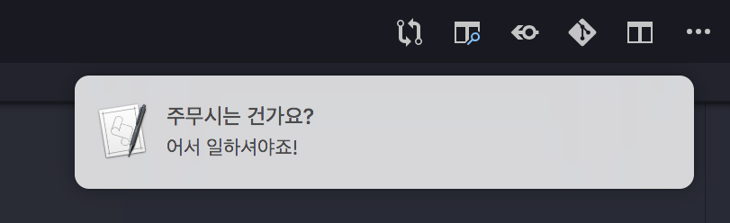
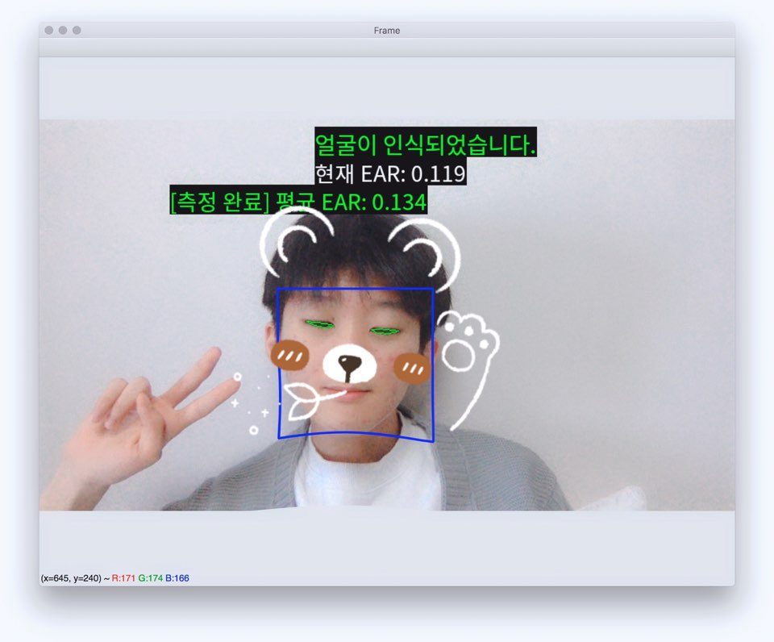

# WatchMe Backend

## main
현재 눈 감김 여부를 연속적으로 출력

```json
{"closed": 0}
```

- `-1`: 얼굴을 찾지 못함
- `0`: 눈을 뜨고 있음(false)
- `1`: 눈을 감고 있음(true)

`parent.cs`에서는 눈을 감고 있다는 데이터를 `closedMax` 이상(`closedError`의 오차를 가짐) 수신하면 졸고 있는 것으로 인식함



> 어서 일어나. 코딩해야지

`osascript`로 알람 표시

## (auto) customize



> 사실 필터 기능 따위는 없었으나 안구 건강을 위해서 넣음

- 각 사용자에 맞게 자동으로 적절한 값의 `ear_thresh`를 설정할 수 있게 해줌
